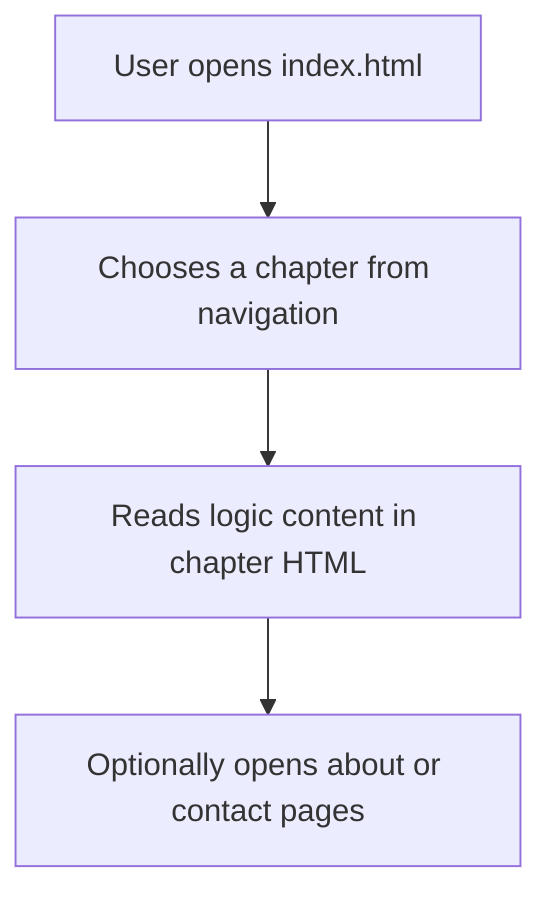

# 📘 Logic Book

An educational **website for a book** that teaches logic concepts through clear lessons, interactive examples, and structured chapters. Ideal for students, teachers, and self-learners looking to master logical reasoning fundamentals.

---

## 🧠 Workflow Diagram



---

## 📁 Project File Structure

```
Logic_Book/
│
├── chapters/              # HTML files for each logic chapter
│   ├── chapter1.html
│   ├── chapter2.html
│   ├── ...
│   └── chapter8.html
│
├── css/                   # Stylesheets
│   └── style.css
│
├── js/                    # JavaScript logic
│   └── main.js
│
├── assets/                # Images or media used (e.g., bg.jpg)
│   └── bg.jpg
│
├── index.html             # Main homepage
├── about.html             # Info about the book
├── contact.html           # Contact/help form
└── README.md              # Project documentation
```

---

## 🚀 Getting Started

1. **Clone this repository:**
   ```bash
   git clone https://github.com/ZainulabdeenOfficial/Logic_Book.git
   cd Logic_Book
   ```

2. **Open `index.html` in your browser**
   - Either double-click or use a live server

✅ No setup or installations required — it's a static website.

---

## 🧰 Tech Stack

- HTML5
- CSS3
- JavaScript (Vanilla)

---


## 👨‍💻 Author

**Zain Ul Abdeen**  
📧 zu4425@gmail.com  
🔗 [GitHub Profile](https://github.com/ZainulabdeenOfficial)

---

## 📄 License

This project is licensed under the [MIT License](LICENSE).

---

> ⭐ If this book website helps you, please star the repo!

