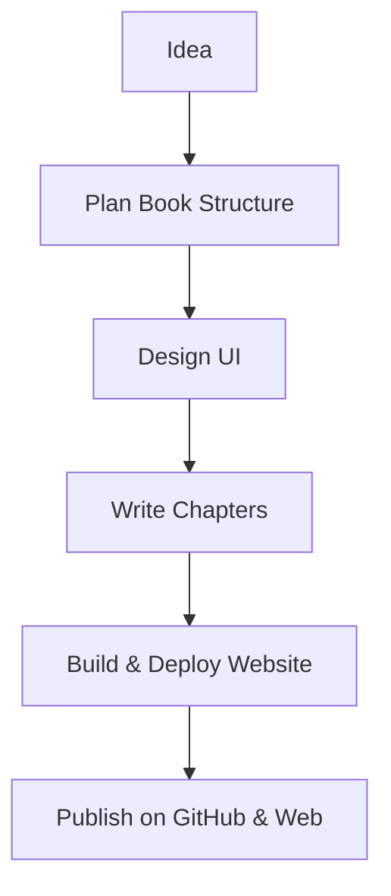

# 📘 Learn Logic Book – Guide for Readers

Welcome to **Logic Book**! This guide will help you get the most out of this open-source logic learning resource. Whether you're a student, teacher, or enthusiast, you can read, understand, and even contribute to the book!

---

## 📚 What Is Logic Book?

**Logic Book** is a beautifully structured website where you can read logical concepts in an easy, visual, and web-friendly way.

🖥️ **Live Website**: [logicbook.dpdns.org](https://logicbook.dpdns.org/)  
📦 **GitHub Repo**: [Logic_Book](https://github.com/ZainulabdeenOfficial/Logic_Book)

---

## 🗂️ File Structure Overview

```bash
Logic_Book/
│
├── public/
│   └── assets/images/     # Book covers, illustrations
│
├── src/
│   └── components/        # Website components (navbar, pages)
│
├── index.html             # Main homepage of the book
├── README.md              # Main info about the repo
├── learn.md               # 👉 You're reading it now
```

---

## 🚀 How to Read the Book

There are two main ways to read:

### 1. Online Reading (Recommended)
- Visit the official website: [https://logicbook.dpdns.org](https://logicbook.dpdns.org)
- Navigate chapters visually
- Mobile-friendly and fast

### 2. Offline Reading
- Clone or download the repo
- Open `index.html` in your browser

```bash
git clone https://github.com/ZainulabdeenOfficial/Logic_Book.git
cd Logic_Book
```

---

## 🧠 What You'll Learn

- Propositional Logic
- Truth Tables
- Logical Operators
- Tautologies & Contradictions
- Logical Equivalence
- Applications of Logic in Programming

Each topic is structured into **interactive content** and **visual examples**.

---

## 🎨 Book Cover


---

## 📈 Project Workflow



---

## ✍️ Contributions Welcome!

Want to improve a topic or add exercises? You're welcome to contribute:

```bash
# Fork the repo
# Make changes in a branch
# Submit a pull request
```

See `CONTRIBUTING.md` (if available) for contribution guidelines.

---

## 📧 Contact

If you like this book or have questions:

- 💬 GitHub Issues: [Open an issue](https://github.com/ZainulabdeenOfficial/Logic_Book/issues)
- ✉️ Author: [Zain Ul Abdeen](https://github.com/ZainulabdeenOfficial)
